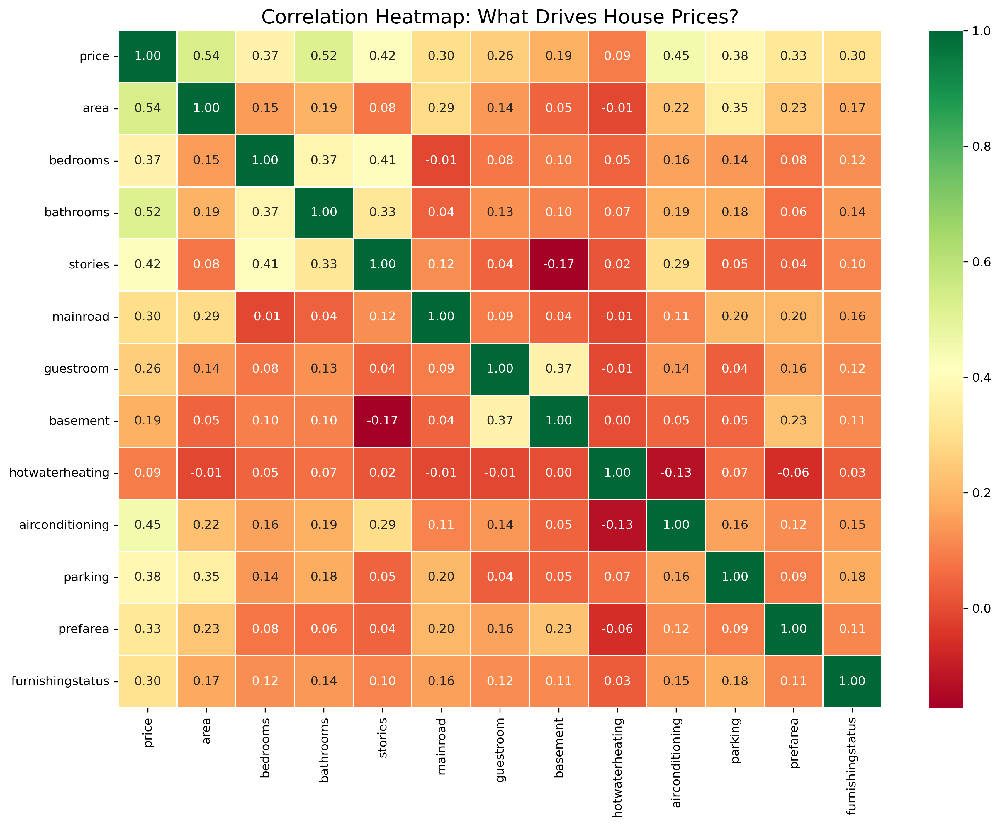
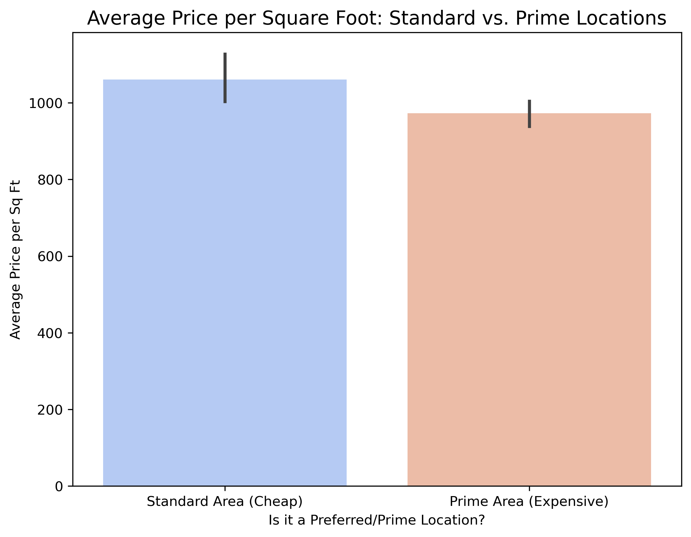

# Housing Price Prediction: Exploratory Data Analysis (EDA)

## 📌 Project Overview
This repository contains the Data Cleaning and Exploratory Data Analysis (EDA) phase for the Housing Prices dataset.
## 🛠️ Data Integrity & Cleaning Summary
* **Missing Values:** 0% missing data across all 13 attributes.
* **Duplicates:** 100% unique observations confirmed via whole-row deduplication.
* **Categorical Encoding:** Successfully converted binary text features (`mainroad`, `airconditioning`, `prefarea` etc.) into numeric boundaries (1/0) to enable robust statistical correlation tracking.

## 📊 Key Insights & Findings

### 1. Target Distribution & Volatility
The target variable (`price`) exhibits a strong **right-hand skewness of 1.21**. This distribution indicates a highly stable market baseline for standard properties, combined with a volatile, high-value "luxury" upper tier pulling the statistical mean upward.

### 2. Primary Feature Drivers
Bivariate correlation metrics identified a clear hierarchy among valuation drivers:
* **Area (0.54):** The most powerful linear predictor of overall price.
* **Bathrooms (0.52):** Shows an exceptionally strong correlation, heavily outperforming total bedroom count. This proves that plumbing density and convenience are prioritized over sheer space configuration.
* **Air Conditioning (0.45):** Acts as the primary luxury asset threshold, establishing a strict minimum pricing floor.

### 3. The Location Valuation Paradox
By engineering a `price_per_sqft` metric, the analysis revealed that while Preferred Areas command a higher baseline average (**1,060.92** vs **972.58** per sq ft), maximum ceiling peaks are actually observed within Standard Areas. This proves mathematically that premium internal features (AC, structural updates, bath count) can completely override geographic location penalties.

## 🎯 Modeling Recommendations (Next Steps)
1. **Log Transformation:** Due to the severe 1.21 price skewness, a log transformation on the target variable is highly recommended before training linear regression models to handle luxury outliers.
2. **Feature Weights:** `area`, `bathrooms` and `airconditioning` should be heavily weighted as the primary algorithmic inputs.

## 🧰 Tech Stack
* **Language:** Python
* **Libraries:** Pandas, NumPy, Seaborn, Matplotlib
